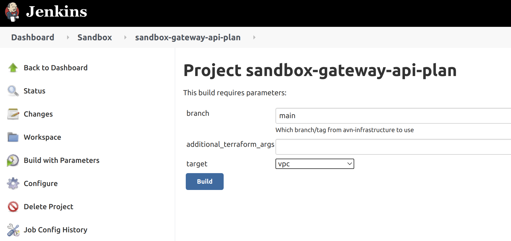

## Infrastructure deployment
The infrastructure can be deployed to a new environment following this process:

- Go to the terraform plan job for the [avn-gateway / Sandbox] [here](https://jenkins.test.aventus.io/view/Sandbox/job/sandbox-gateway-api-plan/)
- click `build with parameters` and select the target `vpc`. This will build the vpc first, a prerequisite for everything else.

- go to the [terraform apply job](https://jenkins.test.aventus.io/view/Sandbox/job/sandbox-gateway-api-apply/) and run the pipeline. You don't need to set any config here beyond the branch
- go back to the [plan phase](https://jenkins.test.aventus.io/view/Sandbox/job/sandbox-gateway-api-plan/) and run the pipeline again but target `all`. This will apply everything else on top of the VPC.
- run the apply job once more to create all other infrastructure.
- Create a kubernetes context by running the following commands. Be sure to set the correct account id and cluster name.
  - `aws eks --region eu-west-1 update-kubeconfig --name avn-gateway`
  - `kubectl config set-context arn:aws:eks:eu-west-1:352429414196:cluster/avn-gateway --namespace kube-system`
  - `kubectl config use-context arn:aws:eks:eu-west-1:352429414196:cluster/avn-gateway-api`
- navigate to the [aws loadbalancer chart](cluster/aws-lb-controller) and run:
  - `helm dep up`
  - `kubectl apply -k "github.com/aws/eks-charts/stable/aws-load-balancer-controller//crds?ref=master"`
  - `helm install aws-lb .`
- navigate to the ec2 [chart](../ec2/chart) and run:
  - `helm template . | kubectl apply -f -`
The manual kubernetes steps are here until the pipelines have been put in place.