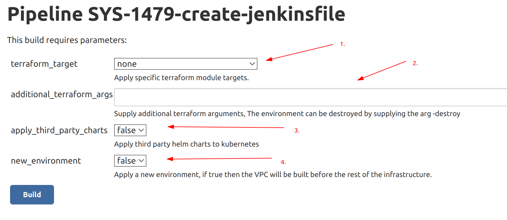
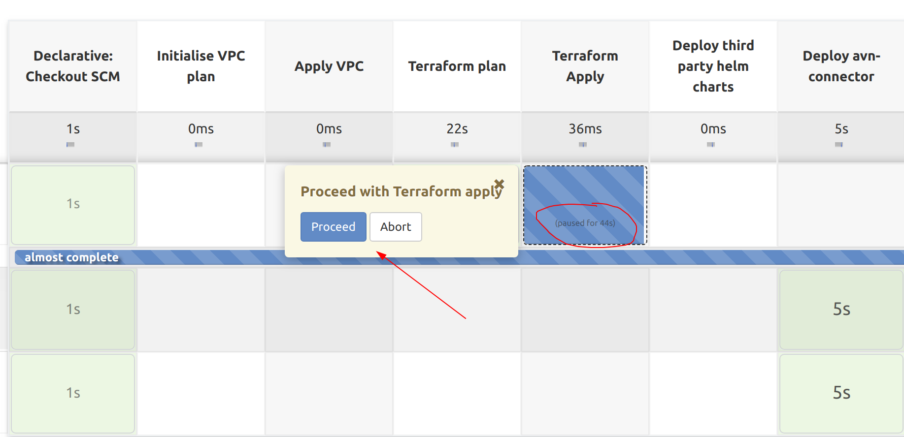

## Infrastructure deployment
The infrastructure can be deployed to a new/current environment following this process:

Go to the avn-gateway-sandbox-infrastructure job [here](https://jenkins.test.aventus.io/view/Sandbox/job/avn-gateway-sandbox-infrastructure/). You will see a list of branches, if your branch isnt there then click on `Scan multibranch pipeline now` and it should appear.

The pipeline is capable of building the entire infrastructure and deploying all relevant resources, if you click on a specific branch (usually `main`) then you can build the project by clicking `build with parameters`. This example is for the branch `SYS-1479-create-jenkinsfile`:

  1. `terraform_target`: This can target a specific terraform module. The option of `all` and `none` will run the entire terraform script or ignore it completely.
  2. `additional_terraform_args`: Supply additional terraform commandline arguments, Eg. `-destroy` will run a destroy plan. If the infrastructure is being destroyed then subsequent kubernetes steps will be ignored.
  3. `apply_third_party_charts`: `true` if you want to deploy the third party helm charts to kubernetes, The Third party charts include the aws-loadbalancer-controller, cert-manager, external-secrets-manager etc.
  4. `new_environment`: `true` if you want to create a new environment. The only difference is that this step will launch the terraform plan/apply for the `vpc` module before running a plan/apply on the rest of the infrastructure. Running the VPC module before everything else if required for a new environment. You can set this to `true` for a current environment and without issue (nothing will be destroyed).

The pipeline will run a terraform plan and will wait for user input to proceed. Be sure to check that the terraform plan is OK before proceeding - if it is not then you can click abort which will abort the pipeline.
